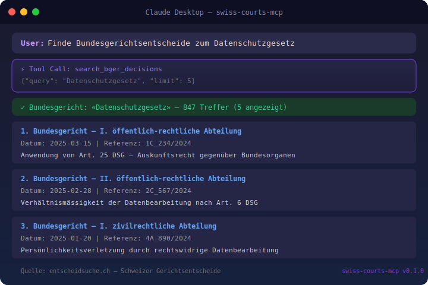

[English Version](README.md)

> **Teil des [Swiss Public Data MCP Portfolios](https://github.com/malkreide)**

# swiss-courts-mcp


[](https://opensource.org/licenses/MIT)
[](https://www.python.org/downloads/)
[](https://modelcontextprotocol.io/)
[](https://github.com/malkreide/swiss-courts-mcp)


> MCP-Server für Schweizer Gerichtsentscheide — Bundesgericht (BGer), Bundesverwaltungsgericht (BVGer), Bundesstrafgericht (BStGer) und alle 26 kantonalen Gerichte via entscheidsuche.ch

<p align="center">
  
</p>

---

## Übersicht

Zugriff auf Schweizer Gerichtsentscheide aller Instanzen über eine einzige MCP-Schnittstelle. Kombiniert Volltextsuche mit strukturierten Filtern nach Kanton, Gerichtsebene, Datumsbereich und Gesetzesreferenzen.

| Quelle | Abdeckung | Daten |
|--------|-----------|-------|
| [entscheidsuche.ch](https://entscheidsuche.ch) | Bund + 26 Kantone | Gerichtsentscheide seit ca. 2000 |

**Synergie mit [fedlex-mcp](https://github.com/malkreide/fedlex-mcp):** Gesetzestext (SR) + Rechtsprechung = vollständige Rechtsrecherche.

---

## Features

- Volltextsuche über alle Schweizer Gerichtsentscheide
- Mehrstufige Gesetzesartikel-Suche mit Regex-Parser und Elasticsearch Boost-Scoring
- Dedizierte Bundesgerichts-Suche mit Abteilungsfilter
- Kantons- und Gerichtsebenen-Filter
- Feed der neuesten Entscheide
- Gerichts-Taxonomie-Auflistung
- Entscheid-Statistiken mit Aggregationen
- Dreisprachig (Deutsch, Französisch, Italienisch)
- Kein API-Key erforderlich

---

## Voraussetzungen

- Python 3.11 oder höher
- Ein MCP-kompatibler Client (Claude Desktop, Cursor, Windsurf, etc.)

---

## Installation

```bash
pip install swiss-courts-mcp
```

Oder aus dem Quellcode:

```bash
git clone https://github.com/malkreide/swiss-courts-mcp.git
cd swiss-courts-mcp
pip install -e ".[dev]"
```

---

## Schnellstart

```bash
# Direkt starten
swiss-courts-mcp

# Oder als Python-Modul
python -m swiss_courts_mcp
```

---

## Konfiguration

### Claude Desktop

In `claude_desktop_config.json` eintragen:

```json
{
  "mcpServers": {
    "swiss-courts": {
      "command": "python",
      "args": ["-m", "swiss_courts_mcp"]
    }
  }
}
```

### Cloud-Deployment

```bash
swiss-courts-mcp --http --port 8000
```

---

## Verfügbare Tools

### Entscheid-Suche

| Tool | Beschreibung |
|------|-------------|
| `search_court_decisions` | Volltextsuche mit Kanton-, Ebenen- und Datumsfilter |
| `get_court_decision` | Einzelnen Entscheid anhand der Signatur abrufen |
| `search_bger_decisions` | Bundesgerichtsentscheide mit optionalem Abteilungsfilter |
| `search_by_law_reference` | Entscheide zu einem Gesetzesartikel finden (z.B. «Art. 8 BV») |

### Gerichts-Informationen

| Tool | Beschreibung |
|------|-------------|
| `list_courts` | Alle indexierten Gerichte auflisten, optional nach Kanton |
| `get_recent_decisions` | Neueste Entscheide, filterbar nach Kanton und Ebene |
| `get_decision_statistics` | Statistiken nach Kanton und Jahr |

### Anwendungsbeispiele

| Anwendungsfall | Tool-Kette |
|----------------|------------|
| Rechtsprechung zu Datenschutz | `search_court_decisions("Datenschutz")` |
| Praxis zu einem Grundrecht | `search_by_law_reference("Art. 8 BV")` |
| Neueste BGer-Entscheide | `search_bger_decisions("Arbeitsrecht", date_from="2024-01-01")` |
| Kombiniert: Gesetz + Praxis | `fedlex_search_laws("DSG")` dann `search_by_law_reference("Art. 25 DSG")` |

---

## Architektur

```
┌─────────────────────────────────────┐
│         MCP-Client (KI)             │
│   Claude / Cursor / Windsurf        │
└──────────────┬──────────────────────┘
               │ MCP-Protokoll
┌──────────────▼──────────────────────┐
│       swiss-courts-mcp              │
│  7 Tools · Pydantic-Validierung     │
│  Elasticsearch Query-Builder        │
└──────────────┬──────────────────────┘
               │ HTTPS (POST/GET)
┌──────────────▼──────────────────────┐
│       entscheidsuche.ch             │
│  Elasticsearch-Backend              │
│  Keine Authentifizierung nötig      │
│  Bund + 26 kantonale Gerichte       │
└─────────────────────────────────────┘
```

---

## Sicherheit & Limits

| Aspekt | Details |
|--------|---------|
| **Zugriff** | Nur lesend (`readOnlyHint: true`) — der Server kann keine Daten ändern oder löschen |
| **Personendaten** | Keine Personendaten — alle Entscheide sind öffentliche Gerichtsurteile |
| **Rate Limits** | Eingebaute Limits (max. 50 Ergebnisse pro Suche, 50 Aggregations-Buckets) |
| **Timeout** | 30 Sekunden pro API-Aufruf |
| **Authentifizierung** | Kein API-Key nötig — entscheidsuche.ch ist öffentlich zugänglich |
| **Lizenzen** | Gerichtsentscheide sind gemäss Schweizer Recht gemeinfrei ([BGG Art. 27](https://www.fedlex.admin.ch/eli/cc/2006/218/de#art_27)) |
| **Nutzungsbedingungen** | Gemäss [entscheidsuche.ch](https://entscheidsuche.ch) — bitte den Server schonend nutzen |

---

## Bekannte Einschränkungen

- Suche ist auf die von entscheidsuche.ch indexierten Entscheide beschränkt
- Volltext-Dokumente werden nicht zurückgegeben — nur Metadaten, Titel und Zusammenfassung
- Statistiken hängen von der Aggregations-Unterstützung des Backends ab
- Die Gerichts-Taxonomie aus `Facetten_alle.json` kann variieren

---

## Tests

```bash
# Unit-Tests
pytest tests/ -v -m "not live"

# Live-API-Tests
pytest tests/ -v -m live

# Linting
ruff check src/ tests/
ruff format src/ tests/
```

---

## Changelog

Siehe [CHANGELOG.md](CHANGELOG.md).

---

## Mitwirken

Siehe [CONTRIBUTING.md](CONTRIBUTING.md).

---

## Lizenz

[MIT](LICENSE)

---

## Autor

Hayal Oezkan · [malkreide](https://github.com/malkreide)

---

## Credits & Verwandte Projekte

- [entscheidsuche.ch](https://entscheidsuche.ch) — Schweizer Gerichtsentscheid-Suchmaschine
- [fedlex-mcp](https://github.com/malkreide/fedlex-mcp) — MCP-Server für Schweizer Bundesrecht (Gesetzes-Synergie)
- [zurich-opendata-mcp](https://github.com/malkreide/zurich-opendata-mcp) — MCP-Server für Zürcher Open Data
- [Model Context Protocol](https://modelcontextprotocol.io/) — Offenes Protokoll für KI-Tool-Integration
