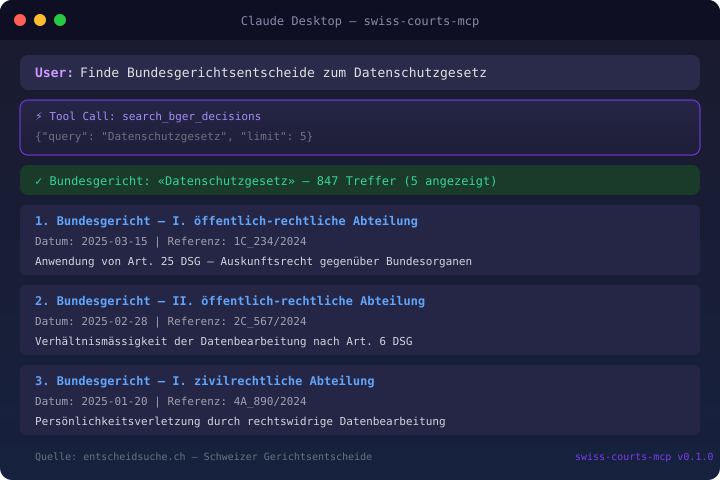

> **Part of the [Swiss Public Data MCP Portfolio](https://github.com/malkreide)**

# 🏛️ swiss-courts-mcp


[](https://opensource.org/licenses/MIT)
[](https://www.python.org/downloads/)
[](https://modelcontextprotocol.io/)
[](https://github.com/malkreide/swiss-courts-mcp)


> MCP Server for Swiss court decisions — Federal Supreme Court (BGer), Federal Administrative Court (BVGer), Federal Criminal Court (BStGer), and all 26 cantonal courts via entscheidsuche.ch

[Deutsche Version](README.de.md)

<p align="center">
  
</p>

---

## Overview

Access Swiss court decisions from all judicial levels through a single MCP interface. Combines full-text search with structured filters for canton, court level, date range, and law references.

**🎯 Anchor demo query:** *"Find Federal Supreme Court case law on data protection (Art. 25 DSG) since 2020 — and if entscheidsuche.ch is down, still answer from the offline dump, clearly flagged."*

| Source | Coverage | Data |
|--------|----------|------|
| [entscheidsuche.ch](https://entscheidsuche.ch) (live, default) | Federal + 26 cantons | Court decisions since ~2000 |
| [SCD dump](https://doi.org/10.5281/zenodo.14867950) (offline fallback) | **Federal Supreme Court only, 2007–2024** | Metadata/regesten, **no full text** |

**Synergy with [fedlex-mcp](https://github.com/malkreide/fedlex-mcp):** Legislation (SR) + case law = complete legal research.

**Availability:** entscheidsuche.ch is non-profit infrastructure without an SLA. When it is unreachable, the server transparently falls back to a cached public dump (see [Offline fallback](#offline-fallback)). Every response declares its origin (`source: "live" | "dump"`), and dump answers carry a `coverage_note` — the fallback is **partial, not equivalent**.

---

## Features

- Full-text search across all Swiss court decisions
- Multi-stage law reference search with regex parser and Elasticsearch boost scoring
- Dedicated Federal Supreme Court search with chamber filter
- Canton and court level filtering
- Recent decisions feed
- Court taxonomy listing
- Decision statistics with aggregations
- Trilingual support (German, French, Italian)
- **Offline fallback** to a cached public dump when entscheidsuche.ch is unreachable — with explicit provenance on every response
- No API key required

---

## Prerequisites

- Python 3.11 or higher
- An MCP-compatible client (Claude Desktop, Cursor, Windsurf, etc.)

---

## Installation

```bash
pip install swiss-courts-mcp
```

Or install from source:

```bash
git clone https://github.com/malkreide/swiss-courts-mcp.git
cd swiss-courts-mcp
pip install -e ".[dev]"
```

---

## Quickstart

```bash
# Run directly
swiss-courts-mcp

# Or via Python module
python -m swiss_courts_mcp
```

---

## Configuration

### Claude Desktop

Add to your `claude_desktop_config.json`:

```json
{
  "mcpServers": {
    "swiss-courts": {
      "command": "python",
      "args": ["-m", "swiss_courts_mcp"]
    }
  }
}
```

### Cloud Deployment (HTTP transport)

The HTTP transport is **off by default**. The default bind host is `127.0.0.1`
(loopback only) — `0.0.0.0` must be opted into explicitly (the Dockerfile does
this). Running HTTP without authentication logs a warning; only do so behind an
authenticating reverse proxy.

```bash
# Local HTTP (loopback), no auth — development only
swiss-courts-mcp --http --port 8000

# Container (binds 0.0.0.0, auth enabled) — see Dockerfile
docker build -t swiss-courts-mcp .
docker run -p 8000:8000 -e MCP_AUTH_SECRET="$(openssl rand -hex 32)" swiss-courts-mcp
```

Relevant environment variables (see [`.env.example`](.env.example)):

| Variable | Default | Purpose |
|---|---|---|
| `MCP_HOST` | `127.0.0.1` | Bind host. Set to `0.0.0.0` only in containers. |
| `MCP_PORT` | `8000` | Bind port. |
| `MCP_ALLOW_PUBLIC_BIND` | `false` | Suppress the `0.0.0.0` warning (containers). |
| `MCP_STATELESS_HTTP` | `true` | Stateless HTTP → horizontal scaling without sticky sessions. |
| `MCP_AUTH_ENABLED` | `false` | Enable bearer-token auth for HTTP. |
| `MCP_AUTH_SECRET` | — | HS256 signing key (dev). |
| `MCP_OAUTH_JWKS_URL` | — | JWKS URL for RS256 validation (production). |
| `MCP_REQUIRED_SCOPES` | — | Comma-separated required scopes. |
| `MCP_CORS_ORIGINS` | — | Comma-separated allowed origins (no wildcard in prod). |

Authentication validates the user identity from the JWT `sub` claim only; see
[ADR 0001](docs/adr/0001-http-auth.md).

### Offline fallback (env)

| Variable | Default | Purpose |
|---|---|---|
| `SWISS_COURTS_FALLBACK_ENABLED` | `true` | Master switch. `0` disables the dump fallback (live-only). |
| `SWISS_COURTS_FORCE_DUMP` | `false` | Force the dump path (skip live) — for pre-warming the cache or offline testing. |
| `SWISS_COURTS_CACHE_DIR` | `platformdirs` cache | Override the cache directory for the downloaded dump. |
| `SWISS_COURTS_DUMP_RECORD` | `14867950` | Zenodo record id of the SCD dump to use. |

Pre-warm the cache (downloads the ~120 MB SCD CSV once, so the first real
outage does not pay the download cost):

```bash
SWISS_COURTS_FORCE_DUMP=1 python -m swiss_courts_mcp  # then issue one search
```

---

## MCP Protocol Version

This server pins MCP protocol version **`2025-11-25`** (constant
`PROTOCOL_VERSION` in `server.py`). A regression test detects drift against the
installed SDK so a protocol bump is a conscious change (version + CHANGELOG +
this section). SDK updates land monthly via Dependabot.

## Project Phase

**Phase 1 — read-only** (see [ROADMAP.md](ROADMAP.md)). All tools are
`readOnlyHint: true`; there are no writing or destructive operations. A move to
Phase 2 (write) requires a clean re-audit and the gates listed in the roadmap.

---

## Available Tools

### Court Decision Search

| Tool | Description |
|------|-------------|
| `search_court_decisions` | Full-text search across all court decisions with canton, court level, and date filters |
| `get_court_decision` | Retrieve a single decision by its unique signature |
| `search_bger_decisions` | Search Federal Supreme Court decisions with optional chamber filter |
| `search_by_law_reference` | Find decisions citing a specific law article (e.g., "Art. 8 BV") |

### Court Information

| Tool | Description |
|------|-------------|
| `list_courts` | List all indexed courts, optionally filtered by canton |
| `get_recent_decisions` | Latest decisions, filterable by canton and court level |
| `get_decision_statistics` | Statistics on indexed decisions by canton and year |
| `get_fallback_status` | Offline-dump cache state, coverage, version, pre-warming (read-only) |

### Tool Annotations

All eight tools share the same hints — they are read-only, idempotent,
non-destructive, and reach an external system:

| Annotation | Value |
|---|---|
| `readOnlyHint` | `true` |
| `destructiveHint` | `false` |
| `idempotentHint` | `true` |
| `openWorldHint` | `true` |

A `rechtsrecherche` **prompt** is also provided (a second MCP primitive
alongside tools).

### Example Use Cases

| Use Case | Tool Chain |
|----------|------------|
| Research case law on data protection | `search_court_decisions("Datenschutz")` |
| Find practice on a constitutional right | `search_by_law_reference("Art. 8 BV")` |
| Latest Federal Supreme Court rulings | `search_bger_decisions("Arbeitsrecht", date_from="2024-01-01")` |
| Combined: Law text + case law | `fedlex_search_laws("DSG")` then `search_by_law_reference("Art. 25 DSG")` |

[→ More use cases by audience →](EXAMPLES.md)

---

## Architecture

```
┌─────────────────────────────────────┐
│         MCP Client (LLM)            │
│   Claude / Cursor / Windsurf        │
└──────────────┬──────────────────────┘
               │ MCP Protocol
┌──────────────▼──────────────────────────────┐
│              swiss-courts-mcp               │
│  8 tools · Pydantic validation              │
│  Elasticsearch query builder                │
│  Provenance envelope: source = live | dump  │
└───────┬──────────────────────────────┬──────┘
        │ ① live (default)             │ ② fallback
        │ HTTPS POST/GET               │ on bot-block / 5xx / 429 /
        │                              │ timeout, or SWISS_COURTS_FORCE_DUMP=1
┌───────▼──────────────────┐   ┌───────▼───────────────────────────────┐
│     entscheidsuche.ch    │   │   SCD dump — Zenodo 14867950 (CC BY)  │
│  Elasticsearch backend   │   │   lazy download → platformdirs cache  │
│  Federal + 26 cantons    │   │   → local SQLite search               │
│  no auth · no SLA        │   │   BGer only · 2007–2024 · no full text │
└──────────────────────────┘   └───────────────────────────────────────┘
```

### Architecture decision

This server uses **Architecture C (metadata-only offline fallback), delivered
via lazy download (Option A mechanics)** — decided after a live probe on
2026-07-19:

- **Live-first, always.** entscheidsuche.ch remains the sole source on success;
  its behaviour is unchanged. The fallback only engages on an availability
  failure (bot-block, HTTP 5xx/429, timeout, connect error) or when forced.
- **Source: the SCD dump** (Zenodo `10.5281/zenodo.14867950`, Version 2024-3,
  **CC BY 4.0**), the ~120 MB CSV — metadata/regesten only, **no full text**. The
  375 MB full-text Parquet and its heavy `pyarrow` dependency were rejected: a
  partial fallback does not justify the footprint, and full text would fake an
  equivalence that does not exist (BGer only).
- **A second candidate was rejected:** Zenodo `5529712`
  ("SwissJudgmentPrediction") is CC BY-**NC-SA** 4.0 — incompatible with this
  MIT project.
- **Consequences:** the CSV is cached on disk (`platformdirs`) and searched via
  SQLite; update detection uses the Zenodo versions API (`conceptrecid`
  7793043). Every response declares `source` (`live`/`dump`) and dump responses
  add a `coverage_note`. CC-BY attribution ships **in the tool output**, not
  only here.

### Offline fallback

The fallback is a **behaviour of the existing tools**, not a separate search
tool (only `get_fallback_status` was added, for transparency). It is
**partial, not equivalent** to the live source:

- Only the **Federal Supreme Court** (BGer/BGE), **2007–2024**, **no full text**.
- **Bundesverwaltungsgericht, Bundesstrafgericht and all 26 cantons are NOT
  covered.** A cantonal or non-BGer query in dump mode returns an explicit
  "not covered" answer — never a silent empty result.
- `get_court_decision` is best-effort in dump mode: SCD case ids (`docref`, e.g.
  `1C_517/2016`) differ from entscheidsuche signatures, so some lookups are
  honestly reported as non-resolvable.
- If neither live nor dump is available, tools return a clear, actionable error
  (no crash, no stack trace).

Inspect the cache and coverage at any time with `get_fallback_status`.

---

## Safety & Limits

| Aspect | Details |
|--------|---------|
| **Access** | Read-only (`readOnlyHint: true`) — the server cannot modify or delete any data |
| **Personal data** | No personal data — all decisions are public court rulings |
| **Rate limits** | Built-in per-query caps (max 50 results per search, 50 aggregation buckets) |
| **Timeout** | 30 seconds per API call |
| **Data source auth** | No API keys required — entscheidsuche.ch is publicly accessible |
| **HTTP transport auth** | Optional bearer-token auth (JWT, `sub`-claim identity); see [ADR 0001](docs/adr/0001-http-auth.md) |
| **Egress** | Code-layer allow-lists (`entscheidsuche.ch` for live; `zenodo.org` for the offline dump), HTTPS-enforced; see [egress policy](docs/network-egress.md) |
| **Error masking** | Internal exceptions are logged server-side only; clients receive friendly messages |
| **Secrets** | No secrets in code/logs; `.env` git-ignored, Gitleaks on PRs; see [secret management](docs/secret-management.md) |
| **Licenses** | Court decisions are public domain under Swiss law ([BGG Art. 27](https://www.fedlex.admin.ch/eli/cc/2006/218/de#art_27)) |
| **Terms of Service** | Subject to [entscheidsuche.ch](https://entscheidsuche.ch) usage terms — please be kind to the server |

---

## Project Structure

```
swiss-courts-mcp/
├── src/
│   └── swiss_courts_mcp/
│       ├── __init__.py
│       ├── __main__.py
│       ├── server.py            # MCP server, 8 tools + 1 prompt, lifespan, auth wiring
│       ├── api_client.py        # HTTP client, ES query builder, egress allow-list
│       ├── fallback.py          # offline dump layer (Zenodo → cache → SQLite)
│       ├── auth.py              # JWT bearer-token verifier (HTTP transport)
│       ├── config.py            # Settings object (env-driven)
│       ├── logging_config.py    # structured logging on stderr
│       └── models.py            # structured response envelope (provenance: live|dump)
├── tests/                       # unit (respx-mocked) + live + security tests
├── docs/                        # egress, secret-management, ADRs
├── .github/workflows/           # ci · security (gitleaks) · live · publish
├── Dockerfile                   # hardened container (non-root, 0.0.0.0 only here)
├── ROADMAP.md
├── pyproject.toml · CHANGELOG.md · LICENSE
├── CONTRIBUTING.md · CONTRIBUTING.de.md
├── SECURITY.md · SECURITY.de.md
└── README.md · README.de.md
```

> **Note (single-file tools):** the 8 tools live in `server.py` rather than a
> `tools/` package. At this count a single module stays readable; the registry
> (`register_tools`) keeps registration declarative. This is a deliberate
> deviation from the "split when > 5 tools" convention and will be revisited if
> the tool count grows. The offline-fallback logic is isolated in `fallback.py`,
> cleanly separated from the live client.

---

## Known Limitations

- Search is limited to decisions indexed by entscheidsuche.ch (not all decisions are publicly available)
- Full-text document content is not returned — only metadata, title, and abstract
- Statistics depend on Elasticsearch aggregation support of the backend
- The court taxonomy structure from `Facetten_alle.json` may vary

**Offline fallback (partial coverage — read this):** the fallback is a safety
net for availability, **not an equivalent mirror** of the live source:

- **Court scope:** Federal Supreme Court only (BGer/BGE). Bundesverwaltungsgericht,
  Bundesstrafgericht and **all 26 cantonal courts are not covered.**
- **Time span:** 2007 – December 2024 (the SCD dump's range). Decisions outside
  this window are not in the dump.
- **Content:** metadata/regesten only — **no full text** offline.
- **Update latency:** the SCD dump is refreshed roughly quarterly on Zenodo, so
  the offline data lags the live index. `get_fallback_status` reports the cached
  version and can check Zenodo for a newer one.
- **Law-reference search** offline only matches references named in the decision's
  subject/regest (`topic`/`issue`) — there is no offline cited-law index.
- Responses always disclose their origin via `source` (`live`/`dump`) and a
  `coverage_note`; the server never silently narrows coverage.

---

## Testing

Unit tests mock all HTTP with `respx`; live tests hit the real API and run in a
separate nightly workflow ([`live.yml`](.github/workflows/live.yml)), never
blocking PRs.

Run from the project root with `PYTHONPATH=src`:

The five gates CI runs — `check_gate_docs.py` holds this list against
`ci.yml`, so it cannot quietly fall behind:

<!-- gates:start -->
```bash
PYTHONPATH=src pytest tests/ -m "not live"
ruff check src/ tests/ scripts/
ruff format --check src/ tests/ scripts/
python scripts/check_version_sync.py
python scripts/check_gate_docs.py
```
<!-- gates:end -->

The live tests are not a gate — they hit the real source and run on a
schedule (`live.yml`), not on pull requests:

<!-- live:start -->
```bash
PYTHONPATH=src pytest tests/ -v -m live
```
<!-- live:end -->

The offline-fallback tests use a small committed schema fixture
(`tests/fixtures/scd_sample.csv`) and mock the Zenodo download with `respx` —
the full ~120 MB dump is never committed or downloaded in CI.

---

## Changelog

See [CHANGELOG.md](CHANGELOG.md).

---

## Contributing

See [CONTRIBUTING.md](CONTRIBUTING.md).

---

## Security

See [SECURITY.md](SECURITY.md) for the security posture and how to report a vulnerability.

---

## License

[MIT](LICENSE)

---

## Author

Hayal Oezkan · [malkreide](https://github.com/malkreide)

---

## Credits & Related Projects

- [entscheidsuche.ch](https://entscheidsuche.ch) — Swiss court decision search engine (live source)
- **Swiss Federal Supreme Court Dataset (SCD)** — offline fallback source, **CC BY 4.0**:
  Geering, F. & Merane, J. (2025). *Swiss Federal Supreme Court Dataset (SCD)*, Version 2024-3. Zenodo. https://doi.org/10.5281/zenodo.14867950
- [fedlex-mcp](https://github.com/malkreide/fedlex-mcp) — MCP Server for Swiss federal law (legislation synergy)
- [zurich-opendata-mcp](https://github.com/malkreide/zurich-opendata-mcp) — MCP Server for Zurich open data
- [Model Context Protocol](https://modelcontextprotocol.io/) — Open protocol for AI tool integration

<!-- mcp-name: io.github.malkreide/swiss-courts-mcp -->

<!-- BEGIN GENERATED: install -->
## Installation

Run via [`uv`](https://docs.astral.sh/uv/)'s `uvx` — no clone or manual install needed. Add to your MCP client config (`mcpServers` for Claude Desktop, Cursor and Windsurf; use a top-level `servers` key for VS Code in `.vscode/mcp.json`):

```json
{
  "mcpServers": {
    "swiss-courts-mcp": {
      "command": "uvx",
      "args": [
        "swiss-courts-mcp"
      ]
    }
  }
}
```
<!-- END GENERATED: install -->
